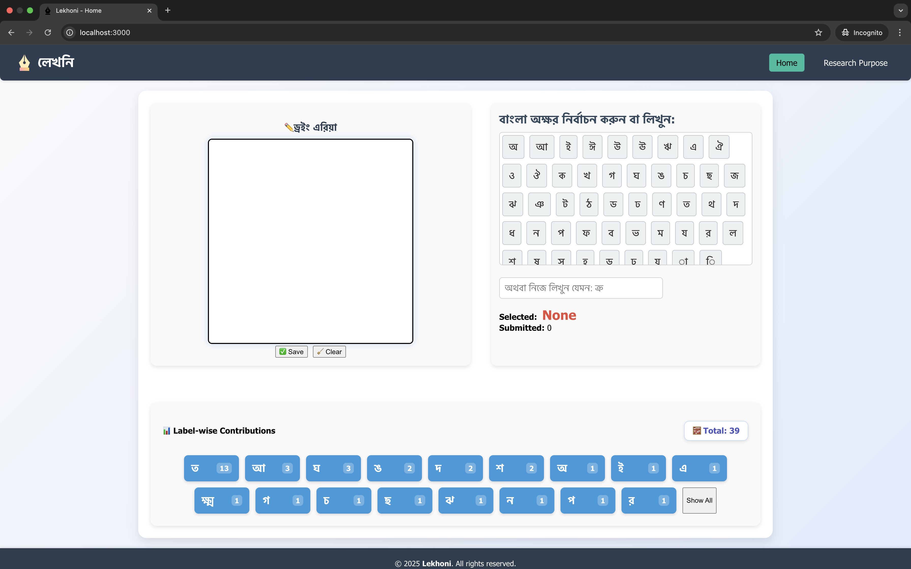
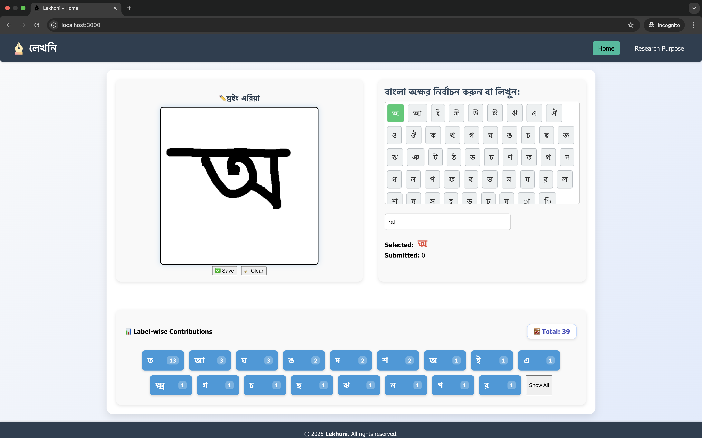
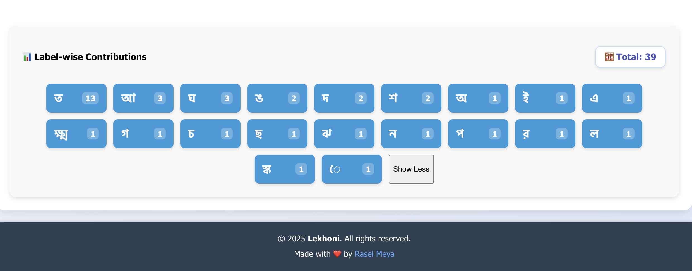

# ✍️ Lekhoni: A Community-Driven Handwritten Bangla Dataset Platform

**Lekhoni** is a collaborative platform designed to build the **largest and highest-quality open-source dataset** of handwritten Bangla characters. This dataset will power OCR systems, handwriting recognition, and other AI applications in Bangla script.

🌐 Live Demo: **Coming Soon!** 
📦 Dataset: Coming Soon!  
🛠️ Open Source: To be released publicly  

---

## 📚 Project Overview

Millions of people speak and write in Bangla, yet Bangla handwriting recognition remains underdeveloped due to the lack of reliable datasets. **Lekhoni** fills this critical gap by enabling users to easily contribute handwritten Bangla characters through an intuitive web interface.

Our target is to collect **200,000+ labeled images** of Bangla characters — including:
- ✅ স্বরবর্ণ (Vowels)
- ✅ ব্যঞ্জনবর্ণ (Consonants)
- ✅ যুক্তবর্ণ (Compound Characters)
- ✅ কারচিহ্ন (Modifiers)
- ✅ সংখ্যা (Numerals)

---

## 🔍 Why Lekhoni?

Despite Bangla’s vast usage, existing OCR systems struggle with handwritten text due to:
- ⚠️ Lack of structured datasets for handwritten Bangla characters
- ⚠️ Limited tools for collecting and labeling such data

**Lekhoni** addresses this by making data collection simple, fun, and collaborative.

---

## 🛠 Key Features

| Feature              | Description                                                                 |
|----------------------|-----------------------------------------------------------------------------|
| 🖌️ Easy Drawing Canvas | Draw Bangla characters using mouse, touch, or stylus                     |
| 🔠 Label Selection     | Choose correct labels from organized Bangla script groups                 |
| 📈 Live Statistics     | View real-time count of images per label and total contribution          |
| ☁️ Secure Storage      | All contributions are stored safely with metadata                         |
| 👤 Contributor Ranking | (Coming Soon) Track individual contributions and show top contributors    |
| 🌍 Open Source         | Source code and dataset will be free for all to use and contribute to     |

---

## 🚀 Goals & Impact

- 📊 Create the most reliable open-source Bangla handwriting dataset
- 🤖 Advance Bangla OCR and handwriting recognition research
- 🌐 Support applications in education, documentation, and cultural preservation
- 🧠 Empower researchers, developers, and students to build AI tools in Bangla

---

## 🙌 How You Can Contribute

It's simple to help:

1. Visit [lekhoni.com]()
2. Draw any Bangla character using your mouse or touch device
3. Select the correct label and submit
4. Repeat and help us reach our goal!

You can also contribute to the **codebase** (coming soon):
- 📁 Improve the UI/UX
- 🐛 Fix bugs
- ✨ Add new features
- 🧪 Help with dataset preprocessing, cleaning, and augmentation

---

### 🖼️ Screenshots

| Drawing Canvas                         | Label Selection                    | Real-Time Stats                    |
| -------------------------------------- | ---------------------------------- | ---------------------------------- |
|  |  |  |

> 📝 Place your screenshots in a `/screenshots` folder and use the correct image filenames.

---

### 🧑‍💻 How It Works (at a glance)

> **Draw → Label → Submit → Track Contributions**

Draw a Bangla character → Select a label from the list
If the label isn't available, enter a custom one in the input field → Click **Save** → See your contribution update live.

---

### 📢 Coming Soon

* 👥 User login and contribution tracking
* 🏆 Leaderboard of top contributors
* 🌐 Public dataset explorer
* 🧠 Model training and accuracy showcase

---

## 📦 Dataset Licensing & Access

- **License:** [CC BY 4.0](https://creativecommons.org/licenses/by/4.0/)
- **Data Format:** `.csv` + image files (PNG)
- **Access:** Publicly downloadable after reaching initial milestone

---

## 💬 Acknowledgements

Special thanks to every contributor, educator, student, and language lover who is helping make Bangla more accessible in the digital age.

> “Your one handwritten character can help millions.”

---

## ⭐ Star the Project!

If you believe in democratizing AI for Bangla, don’t forget to ⭐ this repository and share with others!

